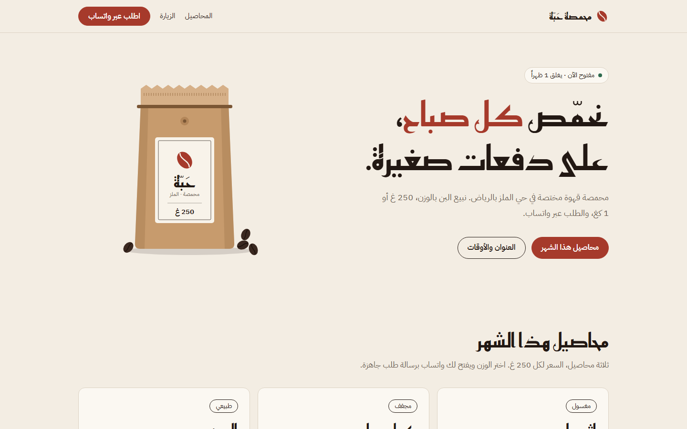
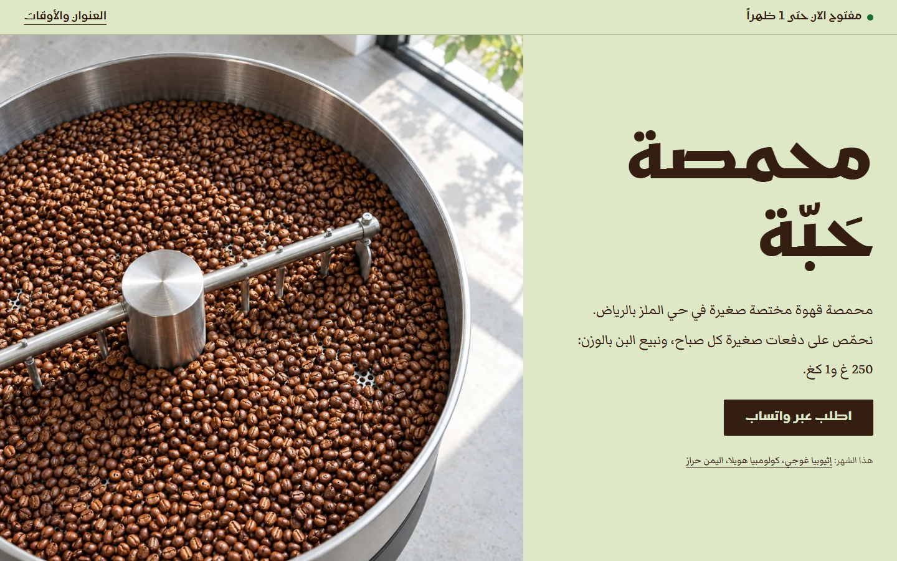

<div dir="rtl" align="right">

<div align="center">

# تصميم · tasmeem

**تصميمٌ يبدو مصنوعاً بيد، لا مولَّداً بآلة. العربية أولاً، ثم الفارسية والإنجليزية.**

مهارةٌ لوكلاء البرمجة (Claude Code وCodex وCursor وأي وكيل يقرأ `SKILL.md`): تبني الواجهات وتراجعها وتصقلها، وتقيس عملها قبل تسليمه، وتصنع صوراً حقيقية بدل أن تسدّ الفراغ بتدرّجات لونية.

[English](README.md)

</div>

---

## لماذا

اطلب من نموذج ذكاء اصطناعي صفحةً تعريفية فستحصل على الصفحة نفسها كل مرة:
- تدرّج بنفسجي إلى أزرق؛
- عنوان في المنتصف بكلمة ملوّنة؛
- شارة صغيرة فوقه، ثم ثلاث بطاقات متطابقة بأيقونات؛
- وظهورٌ تدريجي على كل شيء.

واطلب «شيئاً راقياً» فستأتيك النسخة الثانية من القالب: خلفية كريمية وخط مذيّل ولون طيني.

أما بالعربية فالأمر أسوأ:
- تباعد حروف يقطّع الوصل بين الحروف؛
- مائل مصطنع لخطٍّ لا يعرف الميل؛
- ارتفاع أسطر يقصّ التشكيل؛
- أسهم تشير إلى الجهة الخطأ؛
- وخطوط تسقط إلى ما يتوفر في النظام.

**تصميم تعالج هذا من أصله:**
- تحدد الاتجاه قبل أن ترسم؛
- وتضبط الحروف حسب الخط المكتوب فعلاً في الصفحة؛
- وتملأ مواضع الصور بمواد مصنوعة؛
- ولا تسلّم شيئاً قبل أن تمرّ النتيجة على بوابة قياس.

## ماذا تفعل

- **الاتجاه قبل الرسم:**
  - قراءة للمطلوب، وجملة تصف مشهد الاستخدام، ومفردات من عالم المنتج نفسه؛
  - ثلاثة مؤشرات (الجرأة، والحركة، والكثافة)، واستراتيجية للألوان، وعنصر واحد يميّز التصميم؛
  - ثم فحص على مستويين لاكتشاف الاختيارات الآلية قبل كتابة أي شيفرة.
- **١٦٩ علامة في كتاب قواعد واحد:** الأنماط التي تفضح التصميم المولَّد، كما اتفقت عليها اثنتا عشرة مهارة ومرجعاً، مدموجةً ومعاد صياغتها، وتعارضاتها محسومة مرة واحدة.
- **دليلٌ لا انطباع:**
  - فاحص بلا أي اعتماديات يرصد ٩٦ علامة منها بالملف والسطر؛
  - وفحص اختياري في متصفح حقيقي يقرأ الأنماط المحسوبة: التباين على الخلفية الفعلية، والخط المرسوم فعلاً، والفيضان الأفقي، والحركات العالقة.
- **العربية أولاً:**
  - الخط والاتجاه والأرقام والجمع والتقويم والنصوص ثنائية الاتجاه والنماذج ونبرة الكتابة؛
  - وعلامات الكتابة المولَّدة بالعربية؛
  - ودليل للفارسية (ی وک، ونصف المسافة، والأرقام الفارسية، والتقويم الشمسي)، وآخر للإنجليزية ومزاوجتها مع الخط العربي.
- **صور حقيقية:**
  - مع Higgsfield تعمل تصميم كما يعمل الاستوديو: تصور كامل للصفحة، ثم خريطة للمناطق، ثم مواد مولَّدة لكل منطقة، ثم شيفرة تطابق التصوّر؛
  - نرسم المادة ونبرمج المعنى: كل كلمة وزر وحالة تبقى HTML حياً؛
  - وبوابة تكلفة قبل كل توليد، وملف مصدر لكل صورة.
- **الحركة نظامٌ لا زينة:** قيم موحّدة، ومنحنيات خروج قوية، وحركات قابلة للمقاطعة، وحركة مرتبطة بالتمرير، وانتقالات بين الصفحات، وظهور لا يُخفي المحتوى أبداً، ووضع «تقليل الحركة» مصمَّم لا مُطفأ.
- **الهوية تغلب الذوق، ولا تغلب الإتاحة:** اختيارات العلامة الموثّقة تتجاوز قواعد الذوق وتُسجَّل استثناءات. ولا شيء يتجاوز التباين والتركيز و`lang` و`dir` والصدق وصحة الكتابة.

## قبل وبعد

شغّلنا الطلب نفسه مرتين في جلستين جديدتين من Claude Code: صفحة لمحمصة صغيرة في الرياض، وكل حقائقها مذكورة في الطلب. الأولى بلا أي مهارة، والثانية مع تصميم. لم نعدّل شيئاً بعدها.

</div>

<table>
<tr><th>بلا مهارات</th><th>مع تصميم</th></tr>
<tr>
<td></td>
<td></td>
</tr>
</table>

<div dir="rtl" align="right">

| | بلا مهارات | مع تصميم |
|---|---|---|
| الاتجاه | خلفية كريمية، وعبارة ملوّنة في العنوان، وشارة، وثلاث بطاقات متطابقة | لون البن الأخضر مع حبر بني التحميص (حالتا الحبة)، وتقسيم غير متماثل، وأسعار على هيئة لوحة |
| الصور | كيس مرسوم بـSVG | تصوّران للصفحة، ثم صورة مولَّدة لصينية التبريد وحبوب خضراء مفرّغة، ولكل صورة ملف مصدر |
| القياس (P0 · P1 · P2) | 2 · 9 · 1 | 0 · 8 · 0 |
| الوقت والرصيد | 7 دقائق | 18 دقيقة، و6.5 رصيد من Higgsfield |

الملاحظات الثماني في نسخة تصميم عيبٌ حقيقي واحد: استُخدم خط العرض Kufam في مقاس صغير، فسقطت نقطة النون الأخيرة وصارت «العنوان» تُقرأ «العنوار». كشفت التجربة ثغرة في القواعد، وصارت القاعدة TY-24 ترصدها الآن.

## التثبيت

</div>

```text
/plugin marketplace add Ekka-Barber/tasmeem
/plugin install tasmeem@tasmeem
```

```bash
npx skills add Ekka-Barber/tasmeem
npm i -D playwright && npx playwright install chromium   # اختياري: فحص المتصفح الحقيقي
npm i -g @higgsfield/cli && higgsfield auth login        # اختياري: توليد الصور (يستهلك رصيدك في Higgsfield)
```

<div dir="rtl" align="right">

## الاستخدام

تحدّث مع وكيلك كالمعتاد، وتصميم توجّه الطلب:

</div>

```text
صمّم صفحة حجز لصالون حلاقة في الرياض
راجع واجهة التطبيق وقل لي ما الذي يبدو مصنوعاً بالذكاء الاصطناعي
اصقل صفحة الدفع
اصنع هوية بصرية لمجلّد كتب في جدة
ولّد صورة الواجهة وخامة ورق للصفحة الرئيسية
```

<div dir="rtl" align="right">

| الوضع | ما يحدث |
|---|---|
| **بناء** | اتجاه ← تصوّر ومواد عند الحاجة ← شيفرة ← بوابة |
| **مراجعة** | قياس ثم حكم ثم تقرير مرقّم واحد، ولا يُعدَّل شيء حتى تختار أنت |
| **صقل** | إصلاح ما قيس من مشكلات داخل نظامك الحالي |
| **إعادة تصميم** | يبقى المحتوى والمسارات والهوية، وتتغير البنية |
| **دراسة** | استخلاص روح تصميم يعجبك (بنيته وخطوطه وألوانه وإيقاعه) دون نسخ بكسلاته |
| **هوية** | الموقع، والألوان، والخطوط لكل نظام كتابة، والعلامات، والخامات، والصور، والحركة، والنبرة |
| **مواد** | تصوّر، وخريطة مناطق، ومواد عبر Higgsfield أو /rasm، مع مصدر كل صورة |
| **حركة** | قياس، ثم قيم الحركة ولحظة واحدة منسّقة لكل شاشة |
| **كتابة الواجهة** | كلمات الواجهة بكل لغة موجودة، دون المساس بنص صاحب المشروع |

## العربية تحديداً

- `<html lang="ar" dir="rtl">`، مع وسم كل مقطع بلغة أخرى بلغته واتجاهه.
- خط لكل دور:
  - النسخ للقراءة، والكوفي للواجهة والعناوين؛
  - الرقعة والثلث للعرض فقط؛
  - والنستعليق للأردية.
- الحرف العربي يبدو أصغر من نظيره اللاتيني، فنقيس الفرق ونعالجه، ولا نخمّنه.
- لا تباعد حروف ولا مائل ولا تحويل حالة ولا تطويل بالكشيدة.
- الأسطر بارتفاع ١٫٦ على الأقل للمتن.
- علامات الترقيم العربية: «، ؛ ؟» والأقواس المزدوجة «».
- سياسة أرقام واحدة للمنتج كله، و`Intl` بنظام ترقيم وتقويم مثبّتين.
- ستة أشكال للجمع: «ملف واحد، ملفان، ٣ ملفات، ١١ ملفاً، ١٠٠ ملف».
- الخصائص المنطقية بدل الجهات الفيزيائية، وعكس الأيقونات حسب المعنى: «التالي» يشير إلى اليسار.
- لا نص عربياً داخل صورة مولَّدة، والشعارات والخط العربي بصيغة متجهة دائماً.
- وأخيراً: لا «زيّ عربي» جاهز من فوانيس وقباب ونجوم ثمانية وذهبي على كحلي. الهوية تُبنى من عالم المنتج الحقيقي: حيّه ومواده وناسه وحرفته.

## الشكر

تعلّمت تصميم من impeccable وHallmark وGesso وavoid-ai-design وantislop وtaste-skill ومهارة Anthropic للتصميم وEmil Kowalski وVercel وغيرها، وأعادت صياغة كل قاعدة بكلماتها. التفاصيل في [CREDITS.md](CREDITS.md).

رخصة MIT © 2026 ماجد (Ekka Barber)

</div>
