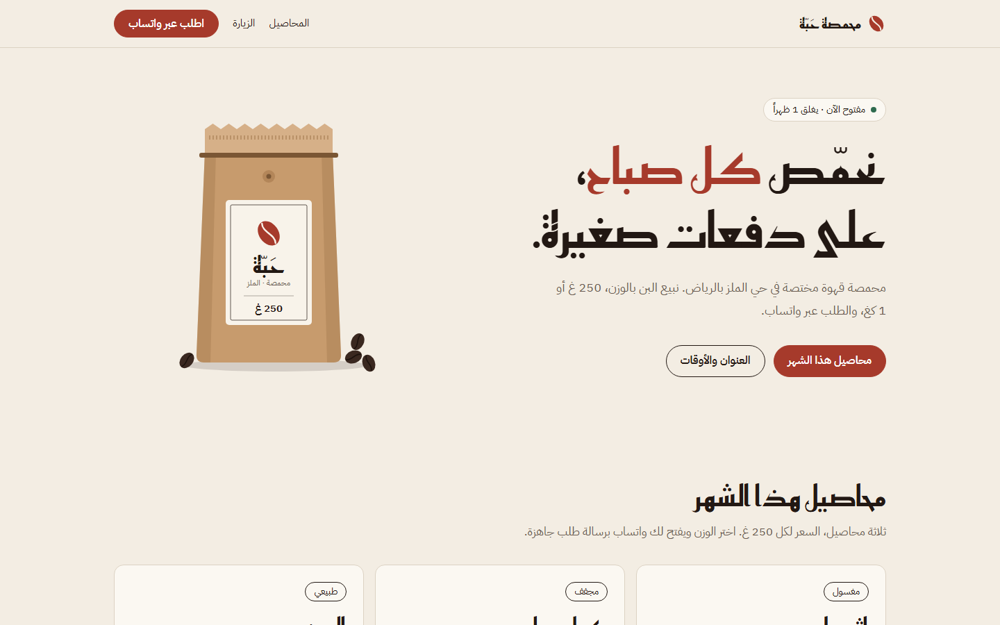
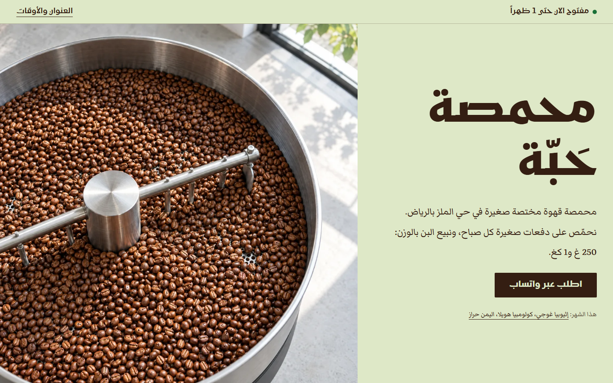

<div dir="rtl" align="right">

<div align="center">

# تصميم · tasmeem

**تصميمٌ يبدو مصنوعاً بيد، لا مولَّداً بآلة. العربية أولاً، ثم الفارسية والإنجليزية.**

مهارةٌ لوكلاء البرمجة (Claude Code وCodex وCursor وأي وكيل يقرأ `SKILL.md`):<br>
تبني الواجهات وتراجعها وتنقدها وتصقلها، وتقيس عملها قبل تسليمه،<br>
وتملأ مواضع الصور بمواد حقيقية بدل التدرّجات اللونية.

</div>

</div>

<div align="center">

[](https://github.com/Ekka-Barber/tasmeem/actions/workflows/test.yml)
[](CHANGELOG.md)
[](LICENSE)
[](https://github.com/Ekka-Barber/tasmeem/commits/main)


[English](README.md) · [CHANGELOG](CHANGELOG.md) · [CREDITS](CREDITS.md)

</div>

<div dir="rtl" align="right">

---

## قبل وبعد

شغّلنا الطلب نفسه مرتين في جلستين جديدتين من Claude Code: صفحة لمحمصة صغيرة في الرياض، وكل حقائقها مذكورة في الطلب. الأولى بلا أي مهارة، والثانية مع تصميم. لم نعدّل شيئاً بعدها.

</div>

<table>
<tr><th width="50%">بلا مهارات</th><th width="50%">مع تصميم</th></tr>
<tr>
<td></td>
<td></td>
</tr>
</table>

<div dir="rtl" align="right">

| | بلا مهارات | مع تصميم |
|---|---|---|
| الاتجاه | خلفية كريمية، وعبارة ملوّنة في العنوان، وشارة، وثلاث بطاقات متطابقة | لون البن الأخضر مع حبر بني التحميص (حالتا الحبة)، وتقسيم غير متماثل، وأسعار على هيئة لوحة |
| الصور | كيس مرسوم بـSVG | تصوّران للصفحة، ثم صورة مولَّدة لصينية التبريد وحبوب خضراء مفرّغة، ولكل صورة ملف مصدر |
| الحقائق | كما وردت | كما وردت، والناقص منها (سعر الكيلو) في قائمة، لا مخترَع |
| القياس (P0 · P1 · P2) | 2 · 9 · 1 | 0 · 8 · 0 |
| الوقت والرصيد | 7 دقائق | 18 دقيقة، و6.5 رصيد من Higgsfield |

الملاحظات الثماني في نسخة تصميم عيبٌ حقيقي واحد: استُخدم خط العرض Kufam في مقاس صغير، فسقطت نقطة النون الأخيرة وصارت «العنوان» تُقرأ «العنوار». كشفت التجربة ثغرة في القواعد، وصارت القاعدة TY-24 ترصدها الآن. هذه تجربة واحدة، لا مقياس شامل.

## التثبيت

</div>

```text
/plugin marketplace add Ekka-Barber/tasmeem
/plugin install tasmeem@tasmeem
```

```bash
npx skills add Ekka-Barber/tasmeem                       # Codex وCursor وغيرهما
npm i -D playwright && npx playwright install chromium   # اختياري: فحص في متصفح حقيقي
npm i -g @higgsfield/cli && higgsfield auth login        # اختياري: توليد الصور (يستهلك رصيدك في Higgsfield)
```

<div dir="rtl" align="right">

## الاستخدام

تحدّث مع وكيلك كالمعتاد، وتصميم تختار الوضع من طلبك:

</div>

```text
صمّم صفحة حجز لصالون حلاقة في الرياض
راجع واجهة التطبيق وقل لي ما الذي يبدو مصنوعاً بالذكاء الاصطناعي
انقد مسار الحجز كأنك زائر جديد على جواله
حصّن صفحة الدفع: الحالات الفارغة والأخطاء والأسماء الطويلة والشبكة البطيئة
اصنع هوية بصرية لمجلّد كتب في جدة
```

<div dir="rtl" align="right">

| الوضع | ما يحدث |
|---|---|
| **بناء** | اتجاه ← الشاشة الأولى تُبنى وتُراجع وحدها ← تصوّر ومواد عند الحاجة ← بقية الصفحة ← بوابة |
| **مراجعة** | قياس ثم حكم ثم تقرير مرقّم واحد بدرجة من ٢٠، ولا يُعدَّل شيء حتى تختار أنت |
| **نقد** | عشرة معايير بدرجات من ٠ إلى ٤، وقائمة للعبء الذهني، وشخصيات مستخدمين، ثم حكم: يُسلَّم، يُصلَح، يُعاد بناؤه، أو تُعاد اللقطات |
| **صقل** | إصلاح ما قيس من مشكلات داخل نظامك الحالي |
| **أجرأ · أهدأ · أبسط** | رفع مؤشر واحد، أو نزع الزخرفة، أو حذف ما لا وظيفة له، دون المساس بالهوية |
| **تحصين** | كل الحالات، والحالات الفارغة، والمحتوى المتطرف، وأخطاء الشبكة، والإدخال بنظامي الأرقام |
| **تكييف** | اللمس والمؤشر، ومنطقة الإبهام، والعروض المتوسطة، والطباعة والبريد |
| **إعادة تصميم** | يبقى المحتوى والمسارات والهوية، وتتغير البنية، والأمر `kept` يثبت أن شيئاً لم يسقط |
| **دراسة** | استخلاص روح تصميم يعجبك (بنيته وخطوطه وألوانه وإيقاعه) دون نسخ بكسلاته |
| **هوية** | الموقع، والألوان، والخطوط لكل نظام كتابة، والعلامات، والخامات، والصور، والحركة، والنبرة |
| **مواد** | تصوّر، وخريطة مناطق، ومواد عبر Higgsfield أو /rasm، مع مصدر كل صورة |
| **حركة** | قياس، ثم قيم الحركة ولحظة واحدة منسّقة لكل شاشة |
| **كتابة الواجهة** | كلمات الواجهة بكل لغة موجودة، دون المساس بنص صاحب المشروع |
| **توثيق** | ملف `DESIGN.md` بصيغة الرموز المفتوحة، أو `PRODUCT.md` |

## ماذا تفعل

- **الاتجاه قبل الرسم:** قراءة للمطلوب ونوع الشاشة (إقناع، تشغيل، قراءة، تجربة)، وجملة تصف مشهد الاستخدام، ومفردات من عالم المنتج نفسه، وثلاثة مؤشرات، واستراتيجية للألوان، وعنصر واحد يميّز التصميم. ثم نسمّي الخطة البديهية ونقيضها المتوقع، ونبتعد عنهما عن قصد.
- **١٩٨ علامة في كتاب قواعد واحد:** الأنماط التي تفضح التصميم المولَّد، كما اتفقت عليها مهارات ومراجع مستقلة، مدموجةً ومعاد صياغتها، وتعارضاتها محسومة مرة واحدة.
- **دليلٌ لا انطباع:** فاحص بلا أي اعتماديات يرصد ١٢٦ علامة منها بالملف والسطر، وفحص اختياري في متصفح حقيقي يقرأ الأنماط المحسوبة: التباين على الخلفية الفعلية، والخط المرسوم فعلاً، والفيضان الأفقي، والحركات العالقة.
- **بوابة تمنع ما يجب منعه فقط:** ثلاث طبقات (الحد الأدنى، والعادات الآلية، واللمسات)، وتجربة كل زر ورابط بيدنا، ومراجعة من وكيل لم يرَ البناء.
- **المنصة قبل المكتبة:** جدول بما تدعمه المتصفحات أواخر ٢٠٢٦ (التموضع بالمرساة، والنوافذ المنبثقة، و`@starting-style`، والحركة بالتمرير، وانتقالات العرض…) مع البديل لكل ميزة.
- **صور حقيقية:** مع Higgsfield تعمل تصميم كما يعمل الاستوديو: تصوّر كامل للصفحة، ثم خريطة للمناطق، ثم مواد مولَّدة لكل منطقة، ثم شيفرة تطابق التصوّر. وبوابة تكلفة قبل كل توليد، وملف مصدر لكل صورة.
- **الهوية تغلب الذوق، ولا تغلب الإتاحة:** اختيارات العلامة الموثّقة تتجاوز قواعد الذوق وتُسجَّل استثناءات. ولا شيء يتجاوز التباين والتركيز و`lang` و`dir` والصدق وصحة الكتابة.

## العربية تحديداً

- `<html lang="ar" dir="rtl">`، مع وسم كل مقطع بلغة أخرى بلغته واتجاهه، والاتجاه في الوسم لا في CSS.
- خط لكل دور: النسخ للقراءة، والكوفي للواجهة والعناوين، والرقعة والثلث للعرض فقط، والنستعليق للفارسية في العناوين والشعر.
- الحرف العربي يبدو أصغر من نظيره اللاتيني، فنقيس الفرق ونعالجه بـ`size-adjust` لكل نظام كتابة، ولا نخمّنه.
- لا تباعد حروف، ولا مائل، ولا تحويل حالة، ولا تطويل بالكشيدة، ولا إيقاف للوصل بين الحروف.
- الأسطر بارتفاع ١٫٦ على الأقل للمتن و١٫٢٥ للعناوين، وكذلك أصناف `leading-*` في Tailwind.
- علامات الترقيم العربية: «، ؛ ؟» والأقواس المزدوجة «».
- سياسة أرقام واحدة للمنتج كله، و`Intl` بنظام ترقيم وتقويم مثبّتين، وحقول تقبل «٠–٩» و«۰–۹».
- ستة أشكال للجمع بحسب آخر رقمين: «ملف واحد، ملفان، ٣ ملفات، ١١ ملفاً، ١٠٠ ملف، ١٠٣ ملفات».
- بداية الأسبوع تختلف بين الدول: الأحد في السعودية، والسبت في مصر والكويت، والإثنين في الإمارات.
- رمز الريال الجديد (U+20C1) وطريقة عرضه بخط خاص، والعملات ذات المنازل العشرية الثلاث.
- الخصائص المنطقية بدل الجهات الفيزيائية، وعكس الأيقونات حسب المعنى: «التالي» يشير إلى اليسار. وجافاسكربت يعرف الاتجاه أيضاً: التمرير والأسهم والسحب و`DirectionProvider` في Radix وshadcn.
- لا نص عربياً داخل صورة مولَّدة، والشعارات والخط العربي بصيغة متجهة دائماً.
- وأخيراً: لا «زيّ عربي» جاهز من فوانيس وقباب ونجوم ثمانية وذهبي على كحلي. الهوية تُبنى من عالم المنتج الحقيقي: حيّه ومواده وناسه وحرفته.

## الفاحص

</div>

```bash
node skills/tasmeem/scripts/tasmeem.mjs scan src/                    # المصدر
node skills/tasmeem/scripts/tasmeem.mjs render http://localhost:3000  # متصفح حقيقي
node skills/tasmeem/scripts/tasmeem.mjs kept old/src src             # ما الذي سقط في إعادة التصميم؟
npm test                                                             # ٢٤ اختباراً
```

<div dir="rtl" align="right">

## الشكر

تعلّمت تصميم من impeccable وHallmark وGesso وavoid-ai-design وantislop وtaste-skill ومهارة Anthropic للتصميم وEmil Kowalski وVercel وdesigning-arabic-frontends وصيغة DESIGN.md ومتطلبات تخطيط النص العربي والفارسي من W3C وغيرها، وأعادت صياغة كل قاعدة بكلماتها. التفاصيل في [CREDITS.md](CREDITS.md)، والمساهمة في [CONTRIBUTING.md](CONTRIBUTING.md).

رخصة MIT © 2026 ماجد (Ekka Barber)

</div>
